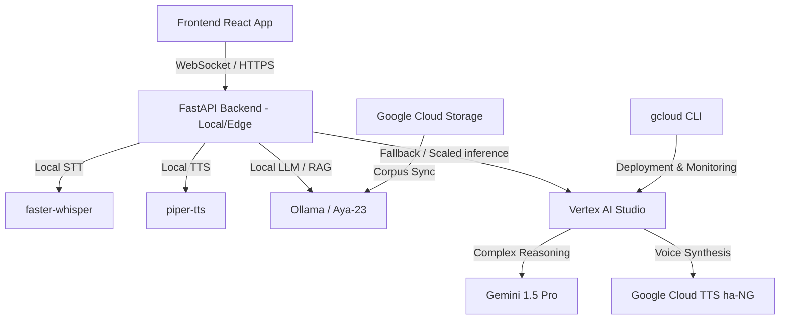

# Google Cloud CLI Integration & Hausa AI Resource Guide

This guide details your active Google Cloud environment and outlines the resources, libraries, and dependencies you can leverage to build an industry-level, linguistically grounded AI for the Hausa language.

---

## 1. Google Cloud CLI Integration Status

Your local environment has the Google Cloud SDK fully integrated. Because PowerShell script execution policies may restrict `.ps1` files on this system, you can use the `.cmd` wrapper:

*   **Active Account:** `adamuwrites@gmail.com`
*   **Active Project:** `studio-980910821-5b814`
*   **SDK Components Installed:**
    *   **Core SDK:** `2026.05.15` (Version `569.0.0`)
    *   **BigQuery Command-Line Tool (`bq`):** `2.1.31`
    *   **Cloud Storage Tool (`gsutil`):** `5.37`
    *   **gcloud-crc32c:** `1.0.0` (for high-speed data validation in cloud storage transfers)

### Recommended CLI Commands for Setup
To run commands directly from the terminal without PowerShell execution blocks, prefix them with `.cmd`:
```powershell
# Verify configuration
gcloud.cmd config list

# Set project explicitly if needed
gcloud.cmd config set project studio-980910821-5b814

# Authenticate application default credentials (ADC) for backend SDKs
gcloud.cmd auth application-default login
```

---

## 2. Google Cloud Infrastructure & APIs for Hausa AI

Given your project's goals of **prosodic fidelity**, **cultural alignment (Kunya & Girmamawa)**, and **dialectal accuracy (Hausar Fada)**, the following Google Cloud offerings provide a strong, scalable backbone:

| Service / API | Specific Leverage for Hausa AI | Core Use Case |
| :--- | :--- | :--- |
| **Vertex AI (Gemini 1.5 Pro/Flash)** | Native multilingual capability. Supports large context windows for processing complete Hausa manuscripts, dictionaries (e.g., Newman's), and corpora. | Custom RAG grounding, prompt-tuning for cultural protocols, and complex semantic translation. |
| **Cloud Speech-to-Text (STT)** | Google's Chirp model (part of STT v2) supports Hausa (`ha-NG`) with high noise-tolerance. | Transcribing spoken Hausa audio inputs in real-time. |
| **Cloud Text-to-Speech (TTS)** | Offers neural voices for Hausa (`ha-NG`) with accurate vowel length and tonal rendering. | Generating natural, high-fidelity spoken responses. |
| **Cloud Storage (GCS)** | Store training data, monolingual corpora, audio recordings, and model weights. | Scalable storage for phonetic and textual corpora. |
| **Compute Engine (GPU Instances)** | Provision `A100` or `L4` GPU instances for custom fine-tuning of open-source models. | Running local LLM/TTS/STT fine-tuning jobs (e.g. LLama/Whisper). |

---

## 3. Computational Linguistics & NLP Ecosystem for Hausa

As a computational linguist, you can combine Google Cloud's infrastructure with specialized open-source tools to establish **industry-level linguistic grounding**:

### A. Phonetics, Tone & Orthography Validation
Hausa is a tonal language (High, Low, and Falling tones) with phonemic vowel length. Traditional models often miss these nuances.
*   **[Epitran](https://github.com/dmortensen/epitran):** Grapheme-to-phoneme (G2P) library with support for Hausa (`hau-Latn`). Crucial for mapping orthography to IPA for downstream speech synthesis.
*   **[Panphon](https://github.com/dmortensen/panphon):** For calculating phonological features and distances, helping enforce correct hook representations (`ɓ`, `ɗ`, `ƙ`, `ts`, `'y`).
*   **Custom Tonal Contours (Praat / Parselmouth):** Use [Parselmouth](https://github.com/YannickJadoul/Parselmouth) (Python interface to Praat) to automatically extract pitch ($F_0$) contours from spoken audio to validate tone mapping rules (e.g., Litvinova's R-to-L melody).

### B. High-Quality Hausa Corpora
For RAG, fine-tuning, and validation, the following datasets are essential:
*   **Masakhane NLP datasets:** Masakhane is the leading grassroots organization for African NLP. They provide:
    *   `mafand-mt` (Machine translation data, including Hausa).
    *   `MasakhaNER` (Named Entity Recognition for Hausa).
*   **Khamisi Corpora & LDC:** Linguistic Data Consortium resources for West African languages.
*   **Hausa C4 & CCNet subsets:** Filtered web-scraped corpora for high-purity text pre-training.

### C. Open-Source LLMs & Audio Architectures (Self-Hosting & Hybrid)
In your backend (`backend/requirements.txt`), you have already incorporated excellent open-source tools:
*   **Faster-Whisper:** For local speech-to-text. Can be fine-tuned on custom Hausa voice datasets.
*   **Piper TTS:** Fast local TTS containing a pre-trained `ha_NG-openbible-medium` voice, perfect for low-latency offline deployments.
*   **Ollama (Aya-23 / Llama 3.1):** Cohere's **Aya-23** model is specifically pre-trained on 23 languages, including Hausa, making it one of the strongest open-source foundation models for African languages.

---

## 4. Architecture Blueprint: Hybrid Sovereign Cloud

To ensure absolute privacy, low latency, and infinite scalability, we recommend a **hybrid cloud-edge architecture**:



---

## 5. Actionable Next Steps

1.  **ADC Authentication:** Run `gcloud.cmd auth application-default login` to grant your local python environment authorization to call Vertex AI APIs during runtime fallback.
2.  **Aya-23 Integration:** Pull the Aya-23 model in Ollama:
    ```bash
    ollama run aya:8b
    ```
3.  **Orthography Hardening:** Create a pre-processing pipeline script utilizing `epitran` to normalize user inputs and enforce correct hooked letters and tone-marking rules before sending text to the LLM.
