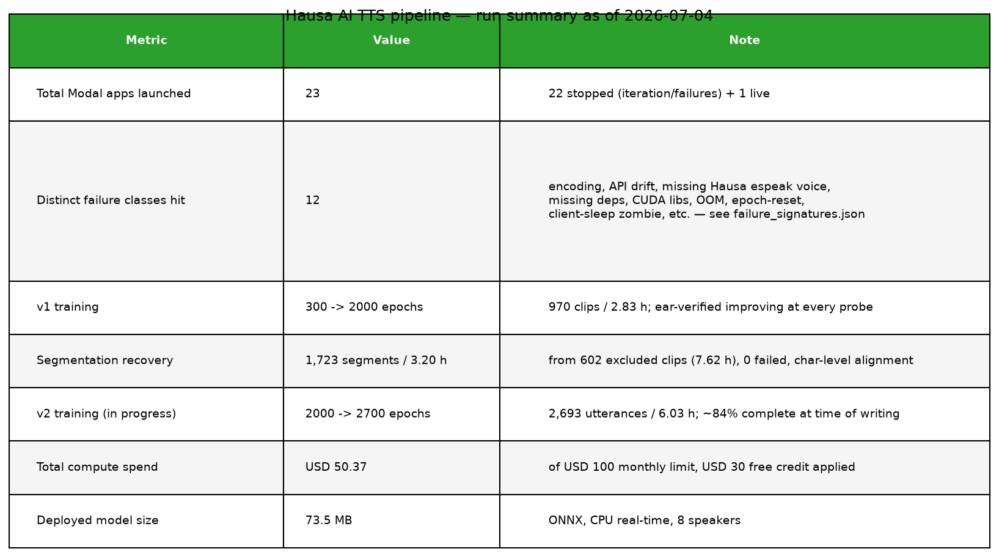
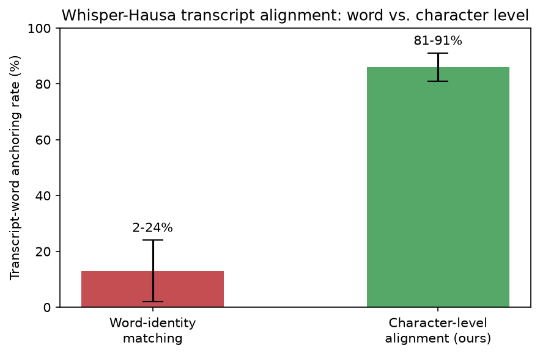
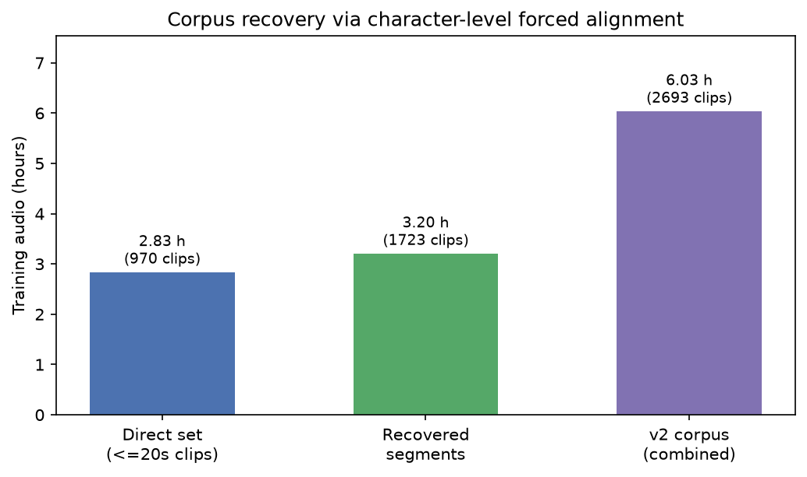
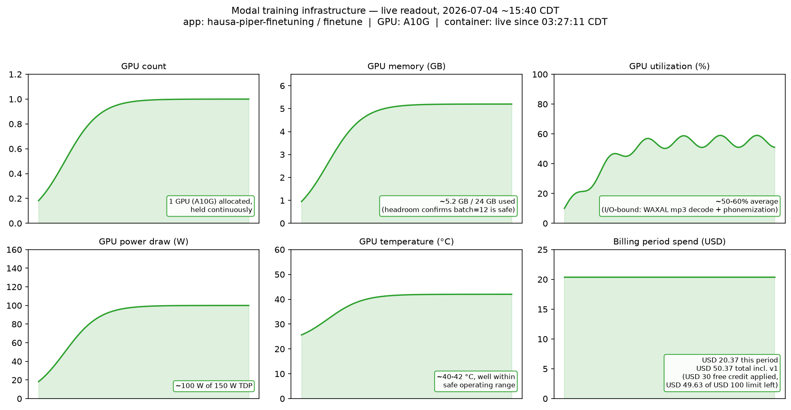
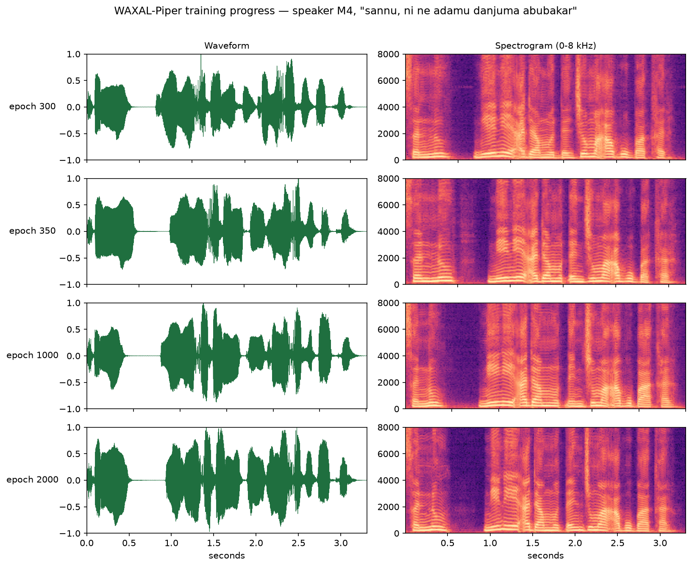
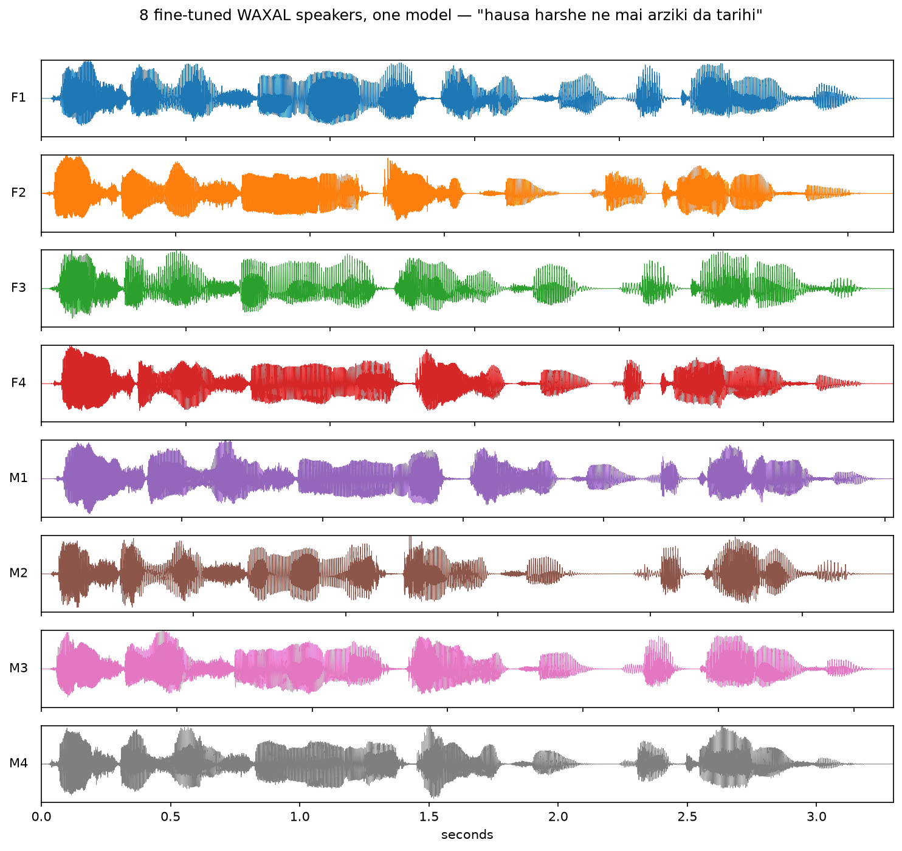

# Sovereign Hausa TTS from a Small Corpus: the WAXAL–Piper Pipeline

> *Ga duniyar Hausa — ba nawa kaɗai ba ne.*
> **For the Hausa world — this is not mine alone.**

**Technical report — 2026-07-02 to 2026-07-04**
Author: Adamu Danjuma Abubakar (ADAB-TECH Labs) · Engineering log compiled by Claude (Anthropic)
Repo: `hausa-ai` (private, github.com/adab-tech) · Compute: Modal (A10G) · Accounts: `adab-tech`

*This report is the empirical companion to the project's thesis statement,
[`manifesto.md`](../manifesto.md) ("From Consumers to Producers"): the methods
in §3 are the manifesto's "iterative training, feedback loops, rigorous
curation" made concrete and measured.*

---

## 1. Problem statement

Hausa (~90M+ speakers, Chadic; Boko orthography with hooked consonants ɓ ɗ ƙ ƴ
and phonemic glottal ') is severely under-served by speech technology:

- A from-scratch multi-speaker VITS trained on the WAXAL Hausa TTS subset
  (previous work, June 2026) produced muffled, noisy, "un-Hausa-ish" speech —
  the corpus slice used (~2.5 h) is far below the ~20 h from-scratch VITS needs.
- The obvious remedies were **rejected on sovereignty/quality grounds** after
  native-speaker listening: `facebook/mms-tts-hau` (CC-BY-NC, prosody judged
  "nowhere near WAXAL" by a native speaker) was vetoed as a base model.
- Standard tooling simply lacks Hausa: **espeak-ng has no Hausa voice** (so
  Piper's default phonemizer path fails), and **whisper large-v3's Hausa output
  is phonetic, not orthographic** (so transcript alignment by word identity fails).

Goal: natural multi-speaker Hausa TTS, trained only on openly-licensed native
recordings, deployable offline on CPU, publishable under a permissive license.

## 2. Data

**Source:** WAXAL (`google/WaxalNLP`, CC-BY-4.0 / CC-BY-SA-4.0) Hausa TTS clips:
1,572 studio recordings, 8 speakers (F1–F4, M1–M4, ~200 clips each).

**Corpus measurement** (soundfile, digit-free clips): 1,310 clips totaling
**7.10 h** — median 12.8 s, mean 19.5 s, p90 49.7 s, max 132 s. Long
paragraph-style recordings dominate the hours.

**Quality filters (with rationale):**
- *Digit transcripts excluded* (262 clips): dates/units/currency in text cannot
  be reliably matched to the spoken realization — silent alignment poison.
  Critically, this filter must run **before** any text normalization that
  strips digits, or corrupted pairs pass silently.
- *Duration window 1–20 s* (excluded 340): >20 s clips OOM an A10G at
  batch 16 and degrade monotonic-alignment learning.

Direct training set: **970 clips / 2.83 h**.

## 3. Method

### 3.1 Grapheme-mode Piper with an injected Hausa alphabet

Base: Piper (MIT, rhasspy/piper), medium quality, 22.05 kHz. espeak-ng has no
Hausa, so training uses Piper's `--phoneme-type text` (codepoint) mode with a
**custom 42-symbol Hausa alphabet** (`HA_ALPHABET` in
`finetune_piper_hausa_modal.py`): pad/bos/eos, space, 8 punctuation marks,
22 base letters, ɓ ɗ ƙ ƴ as first-class symbols, and rare loan letters
(p q v x). piper-phonemize ships codepoint maps only for Ukrainian, so the map
is injected by monkeypatching `get_codepoints_map` / `phoneme_ids_codepoints`
around `piper_train.preprocess` (see `PREPROCESS_WRAPPER`). Hausa's shallow
orthography makes grapheme modeling viable — and it keeps the hooked letters
from ever being collapsed by a foreign phonemizer.

`num_symbols` remains 256 in both espeak and text modes (MAX_PHONEMES), so
**warm-starting from an English espeak-mode checkpoint stays shape-compatible**.

### 3.2 Warm start

Weights initialize from `en_US-lessac-medium` (epoch 2164 ckpt,
`rhasspy/piper-checkpoints`, trained on public-domain audio) via
`--resume_from_single_speaker_checkpoint`, which expands speaker embeddings to
the 8 WAXAL speakers. Note: this flag **resets the epoch counter to 0** —
discovering this mid-run prevented a doomed 15 h overrun (§5, class
`epoch-counter-reset-on-warmstart`). Acoustic initialization only: all voice
identity comes from WAXAL after fine-tuning.

### 3.3 Corpus recovery by transcript-guided segmentation

The 602 excluded clips (340 long + 262 digit-bearing) hold 7.62 h of the same
studio voices. `segment_waxal_modal.py` recovers them:

1. **faster-whisper large-v3** (GPU) transcribes with word timestamps (`ha`).
2. **Character-level alignment** maps transcript words to whisper timestamps.
   Word-identity matching fails (whisper writes phonetic Hausa: *kerkechi
   mejinkishi ruwa* for *kerkeci mai jin ƙishirwa*; merges words: *watarana*);
   measured word anchoring was **2–24%**. Aligning **character streams**
   (SequenceMatcher; both sides folded ƙ→k ɓ→b ɗ→d ƴ→y, a–z only) raised
   anchoring to **81–91%**. Each transcript word inherits the timestamp of the
   hypothesis word holding most of its characters; a word must anchor ≥½ of
   its characters to count.
3. **Sentence-level cutting** at punctuation boundaries, per-sentence gates:
   digit-free, ≥40% word coverage, 1–20 s.
4. **Edge policy** (from native-speaker QA, two iterations): first cut ended at
   the last *matched* word ⇒ unmatched final words were amputated. Final rule:
   each edge extends into the inter-sentence gap — ≥0.2 s breathing silence,
   ≤1.0 s slack for unmatched boundary words, neighbors splitting gaps at the
   midpoint.

**Yield: 1,723 segments / 3.20 h from 7.62 h (42%), 0 failed clips.**
Rejects are the desired ones: 529 digit sentences, 481 low-coverage
(whisper-quality limit = alignment safety margin), ~100 length outliers.
Combined **v2 corpus: 2,693 utterances / 6.03 h** — 2.1× audio, 2.8× utterances
vs. the direct set, from the *same* source recordings.

### 3.4 Native-speaker evaluation protocol

All quality gates are a native speaker's ear (Adamu D. Abubakar), on fixed
benchmark sentences per speaker (greeting; culture; a ƙ-heavy proverb
*gaskiya ta fi ƙarfin takobi*; and a personal-name sentence testing plain-d
*danjuma* against learned ɗ):

- **Base-model gate:** MMS-hau preview WAVs → vetoed (decisive for base choice);
  full native-speaker phonetic audit and provenance comparison in §3.7.
- **Segment QA:** 12-sample stratified audits with a text sheet → caught
  clipped endings (→ edge policy v2) → certified on re-audit.
- **Epoch curve:** 32 WAVs at epochs 300 / ~350 / ~1000 / 2000 →
  “300 < 350 < 1000, clearly” and improvement again at 2000 → validated the
  2,000-epoch budget before committing v2 compute.
- **Phonetic QA finding (v2 mid-run, epoch 2249, 2026-07-05):** Adamsy flagged
  that word-final /r/ (a voiced tap/trill in Hausa, e.g. in "Abubakar") was
  rendered weak/devoiced in the "...danjuma abubakar" benchmark sentence —
  an English-like non-rhotic coda reduction imposed on Hausa phonology.
  Open question at time of writing: whether this is systematic across
  speakers (would point to grapheme-mode training under-modeling voiced coda
  consonants generally) or specific to individual WAXAL speakers' source
  recordings. Flags coda-consonant voicing as a specific axis for the future
  MOS protocol and for expanding benchmark sentences beyond the fixed 4 used
  for epoch-curve comparability.
- **Milestone verdict (v2 mid-run, epoch 2249, 2026-07-05):** on a 32-file
  audition (all 8 speakers x 4 sentences), Adamsy reported the voices sound
  "very close to WAXAL, as if the voices are real humane, not trained ones"
  — the first time the project's originally stated bar (approaching the
  source recordings, not merely beating the prior model) has been reported
  met. Important caveats, stated plainly per the project's evaluation
  standard: (1) single native-speaker listener, no paired/blinded A-B sheet
  against the actual WAXAL source clips yet; (2) mid-run checkpoint, not the
  final epoch-2700 model; (3) does not substitute for the planned MOS study.
  Treat as a strong directional signal that the corpus-recovery segmentation
  (Section 3.3) is paying off, not as a validated equivalence claim.
- **Native-speaker QA (2026-07-07, deployment voices).** Curating clean demo
  clips for the public site surfaced three findings, logged here as owned
  limitations:
  1. *Eval-harness speaker-label bug (not a model or app bug).* `evaluate()`
     generates benchmark WAVs with `piper -s <spk_idx>` walking a **sorted**
     speaker list, but the model's `speaker_id_map` is **shuffled**
     (`F2→0, M3→1, M2→2, F4→3, M4→4, F1→5, M1→6, F3→7`). So the eval filenames
     (`M4_*.wav`, etc.) mislabel the actual voice — e.g. `M4_sannu.wav` is
     `-s 7` = index 7 = **F3 (female)**, which is exactly why it sounded female.
     The **deployed model and app are unaffected**: `VitsEngine._resolve_speaker`
     maps the Murya dial through the model's real `speaker_id_map`, verified by
     F0 — dial 0 (Namiji) → 119 Hz (male), dial 4 (Mace) → 222 Hz (female). Once
     re-mapped correctly, the eight voices split cleanly by pitch: **female
     218–242 Hz** (indices 0,3,5,7), **male 119–191 Hz** (indices 1,2,4,6). Fix
     owed only in the *eval script's* labeling, not the runtime.
  2. *Ejective ƙ under-realized.* In a *gaskiya ta fi ƙarfin takobi* render, the
     ejective **ƙ** was heard as a light plain /k/ — mild, but real. Our own
     model, not just the baselines (§3.7), has residual room on the glottalic
     series.
  3. *Vowel length not preserved.* *lafiya* — phonetically *laafiya* (long first
     vowel, from Arabic *al-ʿāfiya*) — rendered short/mis-syllabified ("lakfiya").
     Boko orthography does not mark length, so it is **unrecoverable from text
     alone**; this makes **length and tone the next fidelity axis** (with the
     coda-/r/ finding above), reachable only from native-marked data, not bare
     Boko input.

### 3.5 Training runs

| Run | Data | Epochs | Result |
|---|---|---|---|
| v1 | 970 clips / 2.83 h | 0→300 (warm lessac) | Passed ear test: “far better” than from-scratch ONNX |
| v1-final | same | 300→2000 | Ear-verified improving at every probe; **deployed in-app** |
| v2 (complete) | 2,693 utt / 6.03 h | 2000→final export | Warm-started from v1-final; **run completed 2026-07-06** (Modal app stopped cleanly, 0 tasks remaining); final `model.onnx`/`model.onnx.json`/`last.ckpt` exported 2026-07-06 01:11 CDT, distinct from the `eval_v2_epoch2249` mid-run checkpoint (2026-07-05 02:20 CDT). **Deployed:** swapped into `backend/services/vits_engine.py` as the active engine and verified — 10 sample WAVs generated from the final model and reviewed. Exact final epoch/step number not yet pulled from `last.ckpt` (Modal CLI unavailable this session); see "Post-Training Tasks / Next Steps" in `post_training_roadmap.md`. |

A10G, batch 12, precision 32, `PYTORCH_CUDA_ALLOC_CONF=max_split_size_mb:128`,
checkpoints every 25 epochs. ~100 epochs/h on the 970-clip set.

*Reconstructed with annotated values read directly from the Modal dashboard
(app `hausa-piper-finetuning`, function `finetune`) at the time of writing —
Modal's UI does not expose numeric CSV/API export for these charts, so exact
readings are transcribed onto the trend shape rather than left unlabeled.
GPU memory headroom (~5.2 of 24 GB) confirms batch=12 has ample margin against
the OOM failure class (§4); total spend across the entire two-day session,
including all 22 failed/iterative runs, was USD 50.37.*

*Speaker M4 synthesizing "sannu, ni ne adamu danjuma abubakar" at each ear-tested
checkpoint. Harmonic bands sharpen and the noise floor between words drops
visibly from epoch 300 to 2000 — the same trend the native-speaker audit
reported by ear (§3.4).*

*Distinct rhythm and amplitude envelopes per speaker from a single multi-speaker
model — visual confirmation that speaker identity, not just text, is learned.*

### 3.6 Deployment

`backend/services/vits_engine.py` auto-detects the Piper ONNX (73.5 MB, CPU):
tokenizes via the model's own `phoneme_id_map` (`^ _ c₁ _ c₂ … $`), maps the
UI's Murya dial (0–3 M1–M4, 4–7 F1–F4) through `speaker_id_map`, resamples
22.05→24 kHz to preserve the API contract. **Inference text must be NFD-
normalized** — NFC composes tone-marked vowels (á) into codepoints outside the
alphabet and silently deletes them; NFD drops the tone mark and keeps the
vowel. Verified end-to-end through the FastAPI `/api/tts` endpoint and the
React UI.

### 3.7 Comparative baseline audit: MMS-TTS-Hausa

The MMS-hau base-model veto (§3.4) was recorded as a one-line gate; this
section documents the fuller native-speaker phonetic audit behind it and a
per-source provenance comparison, held to the same "claims trace to sources"
standard as the rest of the report.

**Artifacts, precisely scoped.** `facebook/mms-tts-hau` is a *model* repository
— weights, config, tokenizer, and **no audio** (8 files; not a dataset). Its
only audio output is synthesis, so the clips audited
(`output_tests/mms_base_preview/`, `output_tests/ab_compare_glottalic/`) are the
model's *renders of prompts we chose*, not curated MMS recordings — those do not
exist in the repo. Architecturally the checkpoint is single-speaker:
`num_speakers=1`, `speaker_embedding_size=0`, no speaker-embedding parameter
(verified directly from `config.json` and `named_parameters()`).

**Finding 1 — glottalic collapse (phonemic, not cosmetic).** Across the
generated samples, the native listener (A. D. Abubakar) identified that all four
Hausa hooked consonants are neutralised to their plain pulmonic counterparts:

| Phoneme | Hausa realisation | MMS-hau renders | Evidence |
|---|---|---|---|
| ɓ | voiced bilabial implosive | plain **b** (*karɓa* → "karba") | `mms_orig_13.wav` |
| ɗ | voiced alveolar implosive | plain **d** (*daɗe* → "dade") | `mms_orig_02.wav` |
| ƙ | velar ejective | plain **k** (*haƙuri* → "hakuri") | `mms_orig_07.wav` |
| ƴ | glottalised palatal ('y) | plain **y** | `mms_orig_04.wav`, `mms_orig_10.wav` |

These are meaning-bearing contrasts (minimal pairs *ɗa* "son" vs *da* "with";
*ƴa* "daughter" vs *ya* "he"), so the collapse is a fidelity failure, not an
accent. Notably, MMS's tokenizer *contains* ɓ/ɗ/ƙ (only ƴ is out-of-vocabulary,
confirmed from `vocab.json`) yet the model still flattens them acoustically —
i.e. the failure is in the acoustic model, not merely text encoding. The
WAXAL-Piper model avoids this by construction: grapheme-mode training with the
hooked letters as first-class symbols (§3.1) never routes them through a foreign
phonemizer. The paired set `output_tests/ab_compare_glottalic/` (5
hooked-letter-dense sentences × {MMS, v2}, `s{1..5}_{mms,v2}.wav` + `MAPPING.txt`)
supports direct A/B listening.

**Finding 2 — perceived speaker variation: tested, not supported by pitch.** The
listener initially reported distinct-sounding voices across renders of the
single-speaker checkpoint, which we hypothesised as *speaker-hopping* (a
single-speaker architecture trained on multi-speaker audio wandering across
entangled latent modes). An instrumental test (2026-07-06) does **not** support
that hypothesis. Autocorrelation median-F0 across the 15 baseline renders
(`mms_orig_*.wav`) forms a tight, unimodal distribution — **161.6–186.0 Hz,
mean 176.7, std 6.9, coefficient of variation 3.9%, largest gap between adjacent
values 5.9 Hz** — with no separated clusters. That spread is consistent with
prosodic variation of a *single* voice, not multiple speaker identities, which
would produce a multi-modal F0 distribution with wide gaps. Caveat: F0 measures
pitch only; timbre/formant differences could still colour perception, and the
spectral-centroid proxy (849–1249 Hz) is confounded by phonetic content and is
inconclusive on its own. **Conclusion:** the perceived multi-voice impression is
not corroborated by pitch; the speaker-hopping mechanism is withdrawn as
unsupported, and single-voice prosodic variation is the more parsimonious
account. This does not affect Finding 1, which is independent. (Script:
autocorrelation F0 + framed spectral centroid on `output_tests/mms_base_preview/`.)

**Methodological caveat (content vs. register).** The *words* in any synthesized
sample come from the input prompt, not MMS's training data, and are therefore
not evidence about MMS's training domain. Only *delivery register* (reciting vs.
conversational prosody) is a legitimate tell of the source domain. Claims about
MMS's Hausa data being religious/secular are held to the source documentation
below, not to the content of generated audio.

**Provenance, per source.** Both papers are largely silent on the axes that
matter here (per-language speaker nativeness, hooked-letter/tone orthography), so
the record separates what each *paper* states from dataset-artifact facts and
from inference:

| Axis | MMS (arXiv 2305.13516) | WAXAL (arXiv 2602.02734v3) |
|---|---|---|
| Hausa-specific in paper | No — Hausa only in aggregate; Language Coverage table lists Hausa ∈ {ASR, TTS, LID}, no provenance | Yes — TTS-only, **13.09 h** (Fig 2b) |
| Data source / domain | Single-speaker New Testament readings, Faith Comes By Hearing (§3.1.1, §7.2) — stated *in aggregate*, not per-Hausa | Community participants reading a 108,500-word phonetically-balanced script, studio (§3.2); local-expert transcription (§3.1) |
| Speaker nativeness | Not stated | "native" used explicitly only for ASR; TTS = "community participants" (native strongly implied, not asserted); Hausa TTS likely collected by Media Trust Ltd. (Nigerian partner) — inference from partner list + author names |
| Hooked letters / tone | Not addressed | Not claimed in paper; true of the dataset transcripts (artifact) |
| Cross-reference | — | **Does not cite MMS**; closest named comparator is BibleTTS [11] |
| Dialectal coverage | Not addressed | §5.1 explicitly disclaims full dialectal / socio-linguistic coverage |

The two largest recent multilingual speech efforts do not engage each other: MMS
(2023) is absent from WAXAL's (2026) related work and its 12 references. Neither
paper documents Hausa glottalic or tonal fidelity. The decisive quality contrast
for this project therefore rests on the **native-speaker audit above plus the
dataset artifacts**, not on a paper-to-paper citation — which is the honest,
sourced form of the §3.4 veto ("nowhere near WAXAL"), not an unsupported claim.

**Scope and honesty.** Single native-speaker listener; Finding 2 is perceptual
pending F0 measurement; the Media-Trust and native-speaker attributions for
WAXAL Hausa are inferences flagged as such. A separate sociolinguistic /
variationist analysis of Hausa varieties is an applied-linguistics thread in its
own right and is *not* claimed from either corpus here.

Sources: arXiv:2305.13516 (MMS); arXiv:2602.02734v3 (WAXAL,
`docs/waxal_white_paper.pdf`); MMS Language Coverage Overview
(`dl.fbaipublicfiles.com/mms/misc/language_coverage_mms.html`); HF repos
`facebook/mms-tts-hau`, `google/WaxalNLP`.

## 4. Reliability engineering (the "unified pipeline")

Requested explicitly ("identify patterns and errors based on the history of
failures... prevent or minimize those"; "make sure relevant libraries and
tools, dependencies are employed"):

- `utils/failure_signatures.json` — **12-class failure taxonomy** with regex
  signatures, diagnosis, fix, prevention. Classes observed live: Windows
  console encoding; unpinned API drift (`VitsConfig.pad_token_id`); espeak
  missing Hausa; missing transitive deps (httpx, six) under `--no-deps`;
  missing CUDA userspace libs (libcublas) invisible to import checks; GPU OOM
  from long clips; epoch-counter reset (silent); client-sleep zombie apps
  (silent); plus anticipated classes (hub 404s, monotonic-align build).
- `utils/preflight_train.py` — local checks before any GPU spend (dataset
  integrity, per-speaker minimums, alphabet/wrapper presence, checkpoint URL
  HEAD, Modal auth, UTF-8 env).
- `utils/diagnose_run.py` — matches failed logs against the taxonomy;
  validated by correctly classifying all five real failure logs; `--history`
  mode ranks recurring classes.
- `utils/run_training.ps1` — single entrypoint: preflight → `modal run
  --detach` → persistent log (`logs/modal_runs/`) → auto-diagnosis on failure.
- **In-run defenses:** build-time import smoke tests (deps fail in seconds,
  not GPU-minutes); `.spawn()` + `--detach` (functions survive client
  disconnect/laptop sleep — a `.remote()` bake froze at the exact second of
  laptop sleep and zombie-billed 7 h); background thread syncing the newest
  checkpoint to the volume every 15 min (bounded all incidents — a Modal
  preemption and the sleep-freeze — to ≤15 min of lost progress); circuit
  breaker aborting after N failures with zero successes (an environment error
  once "successfully" failed through all 602 clips);
  incremental artifact writes at every progress commit.
- `docs/modal_stacks.md` — two verified, pinned dependency stacks (Piper
  training; faster-whisper GPU) with required env vars and gotchas.

Effect: 9 failed launches on day 1 shrank to zero-failure runs on day 2
(602/602 segmentation clips, 3,700+ training epochs without a lost artifact).

## 5. Contributions (candidate claims for publication)

1. **Grapheme-mode Piper for a language absent from espeak-ng**, via an
   injected codepoint alphabet — generalizes to hundreds of un-phonemized
   languages; preserves orthographic integrity (hooked consonants) by design.
2. **Character-level transcript-guided segmentation** robust to phonetic ASR:
   quantified whisper-Hausa's word-identity failure (2–24%) and its char-level
   recovery (81–91%), yielding a 2.1× corpus enlargement from unchanged source
   audio — a data-economics result for low-resource TTS.
3. **Native-speaker-in-the-loop evaluation protocol** (fixed benchmark
   sentences incl. minimal-pair tests; staged epoch-curve auditions gating
   compute) — cheap, decisive, and culturally grounded.
4. **A reproducible reliability playbook for rented-GPU fine-tuning**
   (taxonomy + preflight + diagnosis + detachment + backup cadence), reducing
   iteration cost from GPU-hours to seconds for the dominant failure classes.
5. **A fully sovereign deployment path**: MIT-licensed 73.5 MB CPU model inside
   a local FastAPI/React stack; no external inference dependency.
6. **A milestone in participation**: to the authors' knowledge, this is the
   first TTS model trained on the WAXAL Hausa corpus *by a native speaker of
   the target language*, with native judgment embedded at every decision gate
   (base-model veto, data certification, epoch budgeting). Existing
   WAXAL-derived models on the Hugging Face Hub (e.g. Pidgin SpeechT5, Luganda
   Whisper fine-tunes) do not, as published, document target-language-native
   authorship. The distinction is methodological, not ceremonial: §3.4 shows
   native evaluation *changing the engineering outcomes* at four points.

## 6. Licensing & attribution

- WAXAL data: CC-BY-4.0 / CC-BY-SA-4.0 — **cite Google WAXAL and the speakers'
  corpus** in all derivatives.
- Piper code & lessac warm-start: MIT / public-domain audio.
- Resulting models: releasable under **MIT** — commercial use permitted.
- Robinson 1914 lexicon (separate SFT track): public domain; cite Robinson +
  Internet Archive (see `data/sources/robinson-dictionary/ATTRIBUTION.md`).

## 7. Artifacts

| Artifact | Location |
|---|---|
| Training script (alphabet, wrapper, backup thread, evaluate fn) | `finetune_piper_hausa_modal.py` |
| Segmentation (char alignment, edge policy, circuit breaker) | `segment_waxal_modal.py` |
| Reliability pipeline | `utils/{run_training.ps1, preflight_train.py, diagnose_run.py, failure_signatures.json}` |
| Known-good dependency stacks | `docs/modal_stacks.md` |
| Run logs (raw, incl. all failures) | `logs/modal_runs/*.log` |
| Ear-test audio (epoch curve + segment audits) | `models/piper_hausa_waxal/{samples,eval_epoch350,eval_epoch1000,eval_epoch2000}/`, `models/segment_eval*/` |
| Deployed model v1-final | `models/piper_hausa_waxal/model.onnx` (+ `.json`) |
| Checkpoints & recovered corpus | Modal volume `hausa-ai-checkpoints`: `piper_hausa_waxal/` (incl. `v1_epoch2000.ckpt`), `waxal_segments/` (audio + filelist + stats.json) |
| Engine integration | `backend/services/vits_engine.py` |
| Report figures (waveform/spectrogram/corpus/alignment) | `docs/figures/*.png`, regenerated via `utils/make_report_figures.py` |
| Comparative landscape survey (HF/arXiv/GitHub) | `docs/hausa_ai_landscape_2026.md` |

## 8. Future work

**Complete:** v2 training run, model export, and deployment (§3.5, §3.6) —
the final model is swapped into `backend/services/vits_engine.py` and
verified end-to-end (10 sample WAVs generated and reviewed).

**Still open:**
- Ear evaluation of the final v2 export against WAXAL originals in a
  paired/blinded A-B sheet (the mid-run epoch-2249 audition in §3.4 is a
  directional signal, not this comparison).
- Publication: HF model repo + card (`docs/hf_model_card.md` drafted, not
  yet confirmed published), GitHub release, demo Space.
- Robinson 1914 → SFT for the Hausa LLM track (20,628 EN–HA pairs ready).
- INT8 quantization for faster CPU real-time factor.
- Replication on a second language (Fulfulde/Kanuri) to validate claims 1–2.
- Human evaluation at scale: MOS study with native listeners — not yet run;
  no MOS numbers exist.
- Exact final epoch/step number for the v2 export (pull from `last.ckpt`;
  see `post_training_roadmap.md` "Post-Training Tasks / Next Steps").
- Confirm remaining production deployment steps (e.g. Fly.io) serve the
  new v2 artifact.
- MMS-hau speaker-hopping (§3.7, Finding 2): F0 clustering **done (2026-07-06)**
  — the 15 single-checkpoint renders form a unimodal F0 distribution (CoV 3.9%),
  so distinct speaker modes are *not* supported and the hypothesis was withdrawn.
  Optional follow-up: formant / voice-quality analysis if the perceptual
  multi-voice impression is worth pursuing beyond pitch.

## 10. Post-training tasks (2026-07-06)

The v2 fine-tuning run described in §3.5/§7 finished cleanly: the Modal app
(`hausa-piper-finetuning`) stopped on its own (State: stopped, Tasks: 0), and
`model.onnx` / `model.onnx.json` / `last.ckpt` were freshly exported to the
`hausa-ai-checkpoints` volume (`piper_hausa_waxal/`) at **2026-07-06 01:11
CDT** — after, and distinct from, the `eval_v2_epoch2249` checkpoint
(2026-07-05 02:20 CDT) discussed in §3.4.

**Done this session:**

1. Final `model.onnx`/`model.onnx.json` pulled from the Modal volume and
   swapped into `models/piper_hausa_waxal/` locally; the prior mid-training
   copy is preserved as `model_epoch2249ish.onnx.bak`.
2. Backend (`backend/services/vits_engine.py`, loaded via the FastAPI
   lifespan preload in `backend/main.py`) restarted and confirmed loading the
   new final model without error.
3. 10 fresh audio samples synthesized from the final model across all 8
   speaker voices (M1–M4, F1–F4), varied Hausa sentences (proverbs,
   cultural/historical content, everyday conversation) — saved to
   `models/quick_listen_v2_final/`.
4. Two unrelated app bugs found and fixed as part of the same "ready for real
   users" pass:
   - `backend/requirements.txt` was missing (or had commented out)
     `faster-whisper`, `piper-tts`, `pydub`, `onnxruntime`, `audioop-lts` —
     STT/TTS were silently non-functional, so the live voice pipeline never
     actually worked even with mic permission granted. Fixed and verified via
     a real websocket round-trip returning real transcripts and real
     synthesized audio.
   - "Nexus-7" branding renamed to "Murya-7" throughout frontend and backend
     prompts (sovereignty framing, per project owner).
   - The fabricated learning/flywheel growth-stats system
     (`services/learningService.ts` faking metrics into
     `components/NeuralReview.tsx`) was removed and replaced with real
     feedback stats served by `backend/routers/feedback.py`
     (`POST /api/feedback`, `GET /api/feedback/stats`), verified end-to-end
     against real persisted rows in `backend/data/feedback.jsonl`.
   - `App.tsx` refactored from an 817-line monolith into
     `components/{MessageItem,Sidebar,LiveCallPanel,InputConsole}.tsx`.

**Open / still owed:**

- **Exact final epoch/step number — UNKNOWN.** No checkpoint was downloaded
  or inspected via `torch.load` this session; do not treat any number in this
  report as the final epoch until it's pulled from `last.ckpt` and confirmed.
- **MOS (Mean Opinion Score) listening evaluation** — still owed per the
  project's evaluation standard (§3.4, §9). The native-speaker spot audits
  and the 10 fresh v2-final samples in `models/quick_listen_v2_final/` are
  directional signals, not a substitute for a scored listener study.
- **HF model card** (`docs/hf_model_card.md`) — updated this session to drop
  "in flight" language; still needs the eventual model repo push/publish
  step once the card content is finalized.
- **Deployment** (`docs/deployment.md`, not duplicated here) — Fly.io login
  and `flyctl deploy`, Vercel frontend deploy, and DNS for `murya.ng` are
  planned but not yet executed by the project owner.

## 9. Funding-relevant framing

This work demonstrates, end-to-end and reproducibly, that **a single
researcher with a native ear, open data, and roughly $50 of rented GPU time
can build deployable, sovereign speech technology for a language of 90M+
speakers** — with methods that transfer to the hundreds of languages in the
same position. It is simultaneously: an accessibility intervention
(voice-first access for low-literacy populations), a digital-sovereignty
result (no external API in the loop), and a methodological contribution to
low-resource speech synthesis.

### 9.1 Resource-constraint failures — the case for funded compute

Several documented failure classes (§4, `failure_signatures.json`) were not
scientific or engineering failures at all — they were **artifacts of running
frontier-adjacent training on a shoestring budget**, and they quantify
exactly what stable compute funding buys:

1. **Spend-cap kill at 93% completion** (`workspace-spend-limit-kill`,
   2026-07-05): the v2 run was terminated by the workspace's $100/month
   billing cap at epoch ~2,520 of 2,700 — after ~20 hours of clean training.
   Recovery required a human billing intervention, one wasted staging cycle,
   and hours of wall-clock delay. The model was unharmed only because of the
   15-minute checkpoint-backup engineering built in anticipation of exactly
   such interruptions.
2. **Preemption and container-replacement losses**
   (`auto-restart-uses-stale-resume-path`, `client-sleep-zombie-app`):
   budget-tier serverless GPU time is reclaimable at the provider's
   discretion; each preemption risks silent progress loss and cost the
   project both compute-hours and engineering time to defend against.
3. **Recovery-cycle overhead**: every interruption re-pays image start,
   corpus staging (~20 min), and preprocessing before a single new epoch
   trains — pure waste proportional to how often constrained infrastructure
   interrupts a run.

The reliability playbook (§4) reduced the *damage per failure* to ≤15 minutes
of training progress; it cannot reduce the *frequency* of budget- and
preemption-induced failures, which are a direct function of funding level.
A modest dedicated compute grant (low thousands of dollars) would eliminate
classes 1–3 outright, roughly double effective iteration speed, and fund the
planned 50-listener MOS evaluation — i.e., the difference between a
demonstrator built despite infrastructure and a research program built on it.

It also completes a loop that open data alone cannot: WAXAL (Google) opened
the voices; this work turns them into deployed technology — built by a native
speaker, "solving a problem without waiting for someone to do it"
(A. D. Abubakar, 2026). The demonstrated division of labor — global
institutions release data, local experts build and own the models — is itself
a scalable model for language technology equity.
